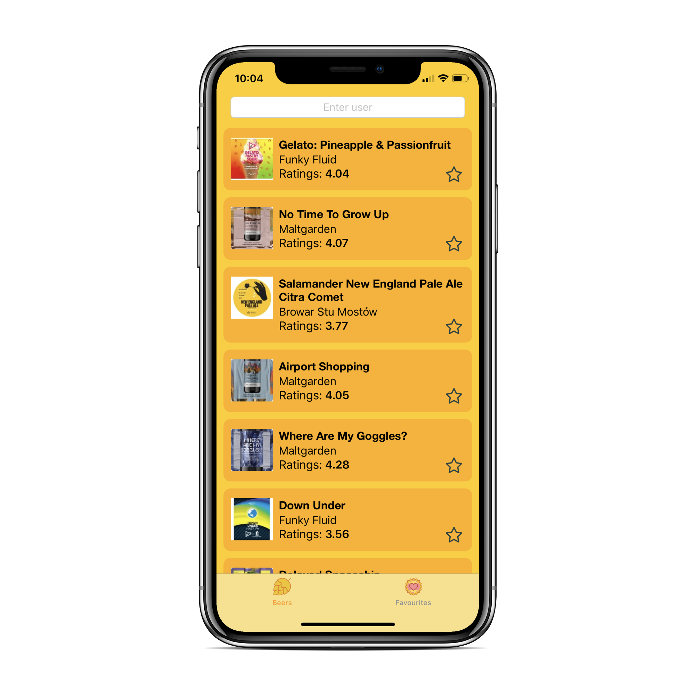
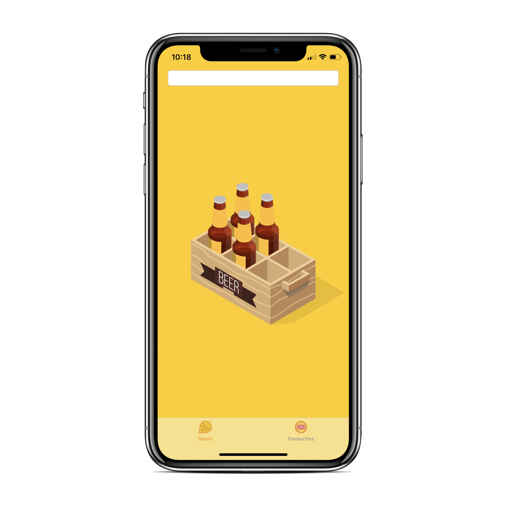
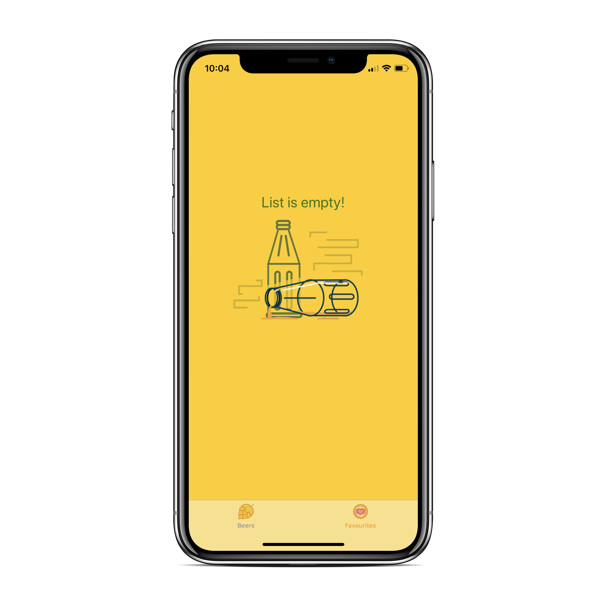

# UntappedMe
> Show last 25 checked in beers using Untapped API - EN 

[](http://cocoapods.org/pods/LFAlertController)

## Description
  - Type Username from Untappd.
  - See last 25 checked in beers.
  - Add beer to favourite. 

### Installation

Install the pods.

```sh
$ pod install
```

You need to fill Client ID and Client Secret in Networking/Configuration

```Swift
clientId = //get client id from Untappd
clientSecret = // get client secret from Untappd
```

#### Check what it's look like

Beers List


Loading animation


Empty list



License
----

MIT
